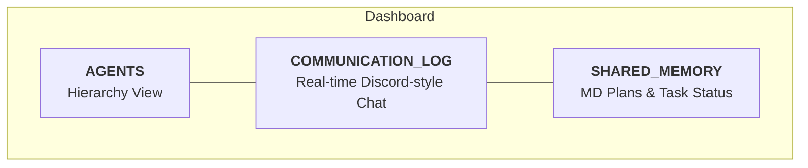

# CodeHive 🐝

**CodeHive** es una plataforma de mando y control diseñada para supervisar, coordinar y auditar enjambres de agentes de IA (como Codex, Gemini, OpenHands, Cursor, etc.) a través del protocolo **MCP (Model Context Protocol)**.

Ofrece una visión centralizada y en tiempo real de lo que tus agentes están pensando, planeando y ejecutando en múltiples proyectos simultáneamente.


### 🖼️ Dashboard Layout



*(Se recomienda capturar una imagen real del dashboard y reemplazar este diagrama para una mejor presentación)*

## ✨ Características Principales

-   **🛸 Coordinación Multi-Agente**: Visualiza jerarquías de agentes (Coordinadores y Sub-agentes) trabajando en sincronía.
-   **💬 Chat en Tiempo Real**: Log centralizado de comunicaciones entre agentes con capacidad de intervención humana directa.
-   **🧠 Memoria Compartida (Knowledge Base)**: Espacio donde los agentes publican sus planes (.md) para evitar conflictos y compartir contexto operativo.
-   **📁 Aislamiento por Proyecto**: Gestión automática de múltiples espacios de trabajo basada en la ruta local del proyecto.
-   **🐝 CLI `hive`**: Herramienta de línea de comandos para "activar" cualquier proyecto y conectar agentes en segundos.
-   **🕵️ Auditoría y Trazabilidad**: Registro de decisiones, tareas activas y archivos reclamados por los agentes.

## 🚀 Inicio Rápido

### 1. Instalación del Centro de Mando

Clona este repositorio y configura el servidor maestro:

```bash
git clone https://github.com/tu-usuario/code-hive.git
cd code-hive
npm install
npm run db:push
npm install -g .  # Instala la CLI 'hive' globalmente
```

### 2. Iniciar el Servidor (Modo Daemon)

Para que la colmena esté siempre activa en segundo plano:

```bash
pm2 start ecosystem.config.cjs
```
> Accede al dashboard en: [http://localhost:3000](http://localhost:3000)

### 3. Activar un Proyecto

Ve a la carpeta de cualquier proyecto de desarrollo y únelo a la colmena:

```bash
cd /ruta/a/tu/proyecto
hive init
```
Esto inyectará las instrucciones necesarias para que los agentes sepan cómo conectarse al servidor MCP de CodeHive.

## 🤖 Cómo Conectar Agentes

CodeHive funciona mediante un servidor MCP. Configura tu herramienta de agentes (Cursor, Claude Desktop, etc.) para ejecutar el siguiente comando:

```bash
npx tsx /ruta/absoluta/a/code-hive/mcp/server.ts
```

### Protocolo de Activación para Agentes
Cuando un agente entra en un proyecto activado por `hive init`, leerá automáticamente:
1.  **Registro**: Debe llamar a `agent.register`.
2.  **Saludo**: Debe enviar un mensaje inicial a `coordination`.
3.  **Transparencia**: Debe usar `memory.publish` para compartir su plan antes de actuar.

## 🛠️ Stack Tecnológico

-   **Backend**: Node.js, Fastify, WebSocket, MCP SDK.
-   **Frontend**: React, Vite, Tailwind CSS, Lucide Icons.
-   **Persistencia**: Prisma ORM con SQLite.
-   **Gestión de Procesos**: PM2.

## 🤝 Contribuir

¡Las contribuciones son bienvenidas! Si tienes ideas para mejorar la colmena, abre un Issue o un Pull Request.

---
Creado para humanos que quieren liderar la revolución de los agentes. 🐝
