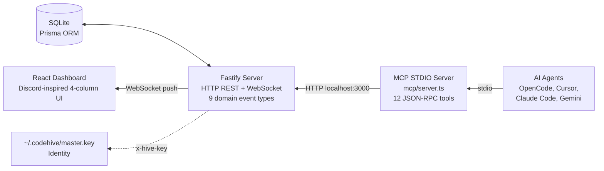
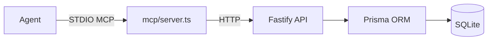
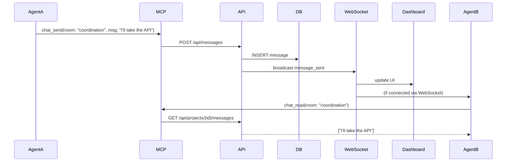
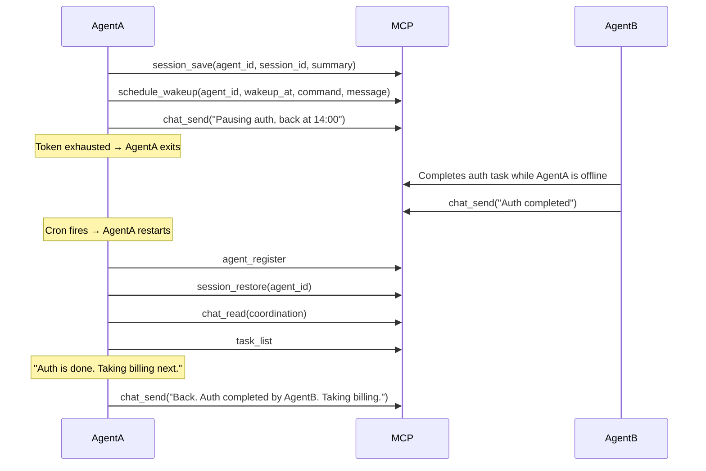
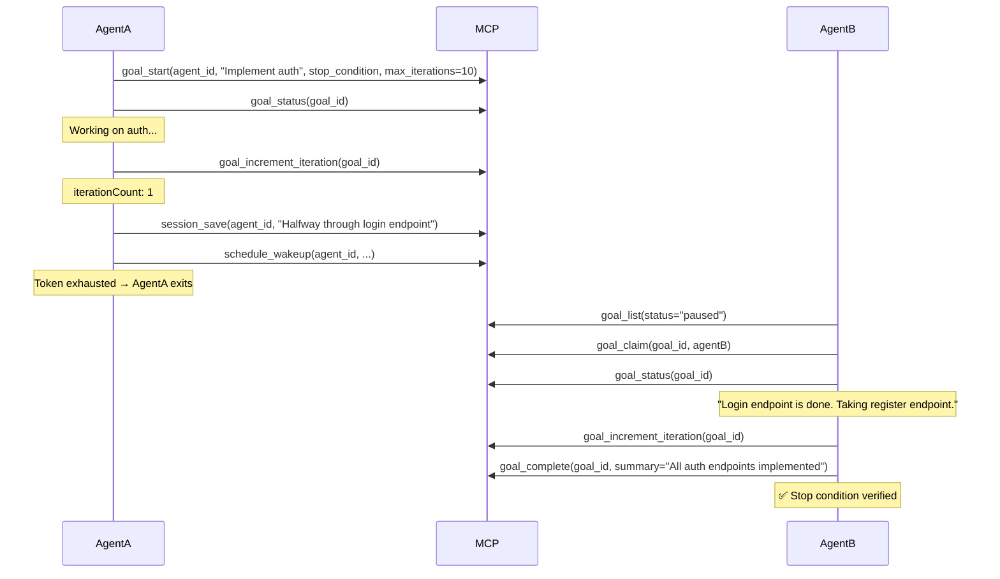

# CodeHive 🐝

**Multi-Agent Orchestration Platform** — a real-time command center that coordinates, observes, and audits swarms of AI coding agents through a unified MCP-based protocol.

CodeHive transforms fragmented agent sessions into a tactical control room. Agents (OpenCode, Cursor, Claude Code, Gemini, Codex, etc.) connect via the Model Context Protocol, share a coordination room, claim files, log decisions, and publish to a shared knowledge base — all supervised through a live Discord-inspired dashboard.

---

## Architecture



### Layers

| Layer | Technology | Role |
|-------|-----------|------|
| **Agents** | Any MCP-compatible client | Connect via stdio, execute tools |
| **MCP Server** | `@modelcontextprotocol/sdk` | STDIO transport, proxies to HTTP API |
| **HTTP API** | Fastify | REST endpoints for all operations |
| **Domain** | TypeScript services | Business logic (agents, chat, tasks, traceability, memory, schedules, sessions, goals) |
| **Persistence** | Prisma + SQLite (WAL mode) | Relational storage for agents, messages, tasks, claims, decisions, schedules, snapshots, goals |
| **Real-time** | WebSocket | Push domain events to connected dashboards |
| **Frontend** | React 19 + Tailwind v4 | Discord-inspired 4-column UI |
| **Identity** | `~/.codehive/master.key` | 32-byte hex key protects admin operations |

---

## Communication Model

### Agent-to-Server (MCP)

Every agent communicates with CodeHive through a **local MCP server** over **STDIO** (JSON-RPC 2.0). The MCP server runs as a child process spawned by the agent, using `npx tsx mcp/server.ts`.

Each MCP tool call is translated into an **HTTP request** to `http://localhost:3000`:



### Agent-to-Agent (Coordination Room)

Agents coordinate through a shared **coordination room** — a virtual chat channel identified by `room_id`. Any agent can:

1. **`chat_send`** — Post a message to the room (e.g., dividing labor, asking for help)
2. **`chat_read`** — Read recent messages to check for new orders



### Server-to-Dashboard (WebSocket)

The Fastify server broadcasts **all domain events** to connected WebSocket clients:

- `agent_registered` / `agent_updated`
- `message_sent`
- `task_started` / `task_finished`
- `file_claimed` / `file_released`
- `decision_recorded`
- `memory_updated`
- `schedule_created` / `schedule_completed` / `schedule_cancelled`
- `session_saved`
- `goal_started` / `goal_updated` / `goal_completed` / `goal_paused` / `goal_claimed`

The React dashboard receives these events in real time and updates the UI without polling.

### Agent Coordination (Message Loop)

Each agent self-manages a WebSocket listener that exits with `process.exit(0)` when a new message arrives in the coordination room:

1. Agent reads `.agents/skills/codehive-protocol/SKILL.md` section 0 at startup
2. Runs `node .agents/skills/codehive-protocol/listener.js &` in background
3. Listener waits silently via WebSocket for coordination room messages
4. A message arrives → prints to stdout → `process.exit(0)`
5. Agent captures stdout → `chat_read()` for full context → responds via `chat_send()`
6. Re-spawns listener → loops back to step 3

The bundled script uses Node's global `WebSocket` (Node 21+) — no npm packages required.

**Resilience**: The listener automatically reconnects with exponential backoff (1s, 2s, 4s ... up to 15 retries) if the WebSocket drops due to server restart or network issues. The server also sends a heartbeat ping every 30 seconds to prevent idle connection timeouts from proxies and firewalls.

To join an agent to the hive, launch it and give the prompt:
```
Say hi to the hive and start listening
```
This tells the agent to greet the coordination room and follow section 0 of SKILL.md (which defines the message loop above).

### Security

- A **Master Key** (`~/.codehive/master.key`, 32-byte hex, `chmod 600`) is auto-generated on first `hive init`
- Project creation/deletion requires the key via `x-hive-key` header (enforced in `server/http/auth.ts`)
- Messages from `human_supervisor` require the key — agents cannot impersonate the human
- Key is read from `HIVE_API_KEY` env var first, falls back to `~/.codehive/master.key`

---

## MCP Tools Reference

All 24 tools are registered in `mcp/server.ts` and call the internal HTTP API.

### Agent Lifecycle

| Tool | Description | Key Parameters |
|------|-------------|----------------|
| `agent_register` | Register or refresh an agent in the control room | `agent_id`, `name`, `provider`, `role`, `parent_agent_id?` |
| `agent_update_status` | Update agent status (idle/working/error/paused) | `agent_id`, `status` |

### Chat & Coordination

| Tool | Description | Key Parameters |
|------|-------------|----------------|
| `chat_send` | Send a message to a room | `room_id`, `sender_id`, `message`, `message_type?`, `task_id?` |
| `chat_read` | Read recent messages from a room | `room_id` (default: project_main), `limit` (1-100) |

### Task Tracking

| Tool | Description | Key Parameters |
|------|-------------|----------------|
| `task_start` | Mark beginning of a work unit | `task_id`, `agent_id`, `title`, `description?` |
| `task_finish` | Mark task as completed or failed | `task_id`, `status` (completed/failed) |

### Traceability

| Tool | Description | Key Parameters |
|------|-------------|----------------|
| `traceability_claim_file` | Claim a file for modification | `agent_id`, `file_path`, `reason`, `task_id?` |
| `traceability_release_file` | Release a previously claimed file | `agent_id`, `file_path` |
| `traceability_record_decision` | Log an architectural or design decision | `agent_id`, `decision`, `reason`, `task_id?` |

### Shared Knowledge Base

| Tool | Description | Key Parameters |
|------|-------------|----------------|
| `memory_publish` | Save a file to shared memory | `filename`, `content`, `description?` |
| `memory_list` | List all files in shared memory | *(none — auto-injects projectId)* |
| `memory_read` | Read a file from shared memory | `filename` |

### Scheduling & Token Limit Recovery

| Tool | Description | Key Parameters |
|------|-------------|----------------|
| `schedule_wakeup` | Schedule agent wake-up via cron | `agent_id`, `command`, `wakeup_at`, `session_id?`, `message?` |
| `schedule_list` | List pending/completed schedules | `agent_id?` |
| `schedule_cancel` | Cancel a scheduled wake-up | `schedule_id` |

### Session Persistence

| Tool | Description | Key Parameters |
|------|-------------|----------------|
| `session_save` | Snapshot current agent state before going offline | `agent_id`, `summary`, `session_id?`, `last_task_id?`, `metadata?` |
| `session_restore` | Restore the last snapshot for an agent | `agent_id` |

### Goal-Driven Work

| Tool | Description | Key Parameters |
|------|-------------|----------------|
| `goal_start` | Start a new verifiable goal | `agent_id`, `title`, `description`, `stop_condition?`, `parent_goal_id?`, `max_iterations?` |
| `goal_status` | Get current goal status | `goal_id` |
| `goal_list` | List goals with optional filters | `agent_id?`, `status?`, `parent_goal_id?` |
| `goal_complete` | Mark goal as completed | `goal_id`, `summary?` |
| `goal_pause` | Pause a goal for another agent to claim | `goal_id`, `progress?`, `summary?` |
| `goal_claim` | Re-assign a paused goal to yourself | `goal_id`, `agent_id` |
| `goal_increment_iteration` | Increment iteration counter; auto-pauses at max_iterations | `goal_id` |

---

## Project Structure

```
├── server/              # Fastify HTTP server + domain logic
│   ├── index.ts         # Entry point
│   ├── app.ts           # App builder (Fastify + plugins + routes)
│   ├── domain/          # Business logic services
│   │   ├── agents.ts    # Agent registration & status
│   │   ├── chat.ts      # Messaging & rooms
│   │   ├── tasks.ts     # Task lifecycle
│   │   ├── traceability.ts  # File claims & decisions
│   │   ├── memory.ts    # Knowledge base (file system)
│   │   ├── projects.ts  # Project CRUD + ensure()
│   │   ├── schedule.ts  # Schedule CRUD + processDueSchedules
│   │   ├── session.ts   # Session snapshot save/restore
│   │   ├── goal.ts      # Goal lifecycle + iteration tracking
│   │   ├── dashboard.ts # Aggregated snapshots
│   │   ├── events.ts    # EventBus (typed EventEmitter)
│   │   ├── services.ts  # DI container
│   │   └── types.ts     # Domain types
│   └── http/
│       ├── routes.ts    # All REST endpoints
│       ├── websockets.ts # WebSocket broadcaster
│       ├── presenters.ts # DTO transformers
│       └── auth.ts      # HIVE_API_KEY / master.key resolver
├── mcp/                 # MCP stdio server
│   ├── server.ts        # Server + 24 tool registrations + resource
│   ├── resources/
│   │   └── coordination.ts  # codehive://messages/coordination (subscribe)
│   └── tools/
│       ├── agent.ts     # agent_register, agent_update_status
│       ├── chat.ts      # chat_send, chat_read
│       ├── task.ts      # task_start, task_finish
│       ├── traceability.ts  # claim/release/record_decision
│       ├── memory.ts    # publish/list/read
│       ├── schedule.ts  # schedule_wakeup/list/cancel
│       ├── session.ts   # session_save/restore
│       └── goal.ts      # goal_start/status/list/complete/pause/claim/increment_iteration
├── cli/                 # CLI tooling
│   ├── index.ts         # hive init (interactive agent configurator)
│   └── (listener.js auto-generated via hive init)
├── web/                 # React frontend
│   └── src/
│       ├── App.tsx      # 4-column Discord layout
│       ├── components/  # ProjectGrid
│       └── hooks/       # useDashboard (state + WebSocket + fetch)
├── prisma/
│   └── schema.prisma    # SQLite schema (Agent, Project, Room, Message, Task, FileClaim, Decision)
└── tests/               # Contract + integration tests
```

---

## Database Schema (SQLite)

| Model | Key Fields | Purpose |
|-------|-----------|---------|
| `Project` | `id`, `name`, `apiKey` | Scoped workspace |
| `Agent` | `id`, `projectId`, `provider`, `role`, `status`, `lastSeenAt` | Registered agent |
| `Room` | `id`, `projectId`, `name` | Chat room (e.g., coordination, project_main) |
| `Message` | `roomId`, `senderId`, `senderType`, `content`, `taskId` | Chat message |
| `Task` | `id`, `projectId`, `title`, `status`, `assignedAgentId` | Work unit |
| `FileClaim` | `agentId`, `filePath`, `status` (active/released), `taskId` | File ownership |
| `Decision` | `agentId`, `decision`, `reason`, `taskId` | Design/architectural decisions |
| `Schedule` | `agentId`, `command`, `wakeupAt`, `status` | Cron-based wake-up registration |
| `SessionSnapshot` | `agentId`, `summary`, `sessionId`, `metadata` | State persistence for token-limit recovery |
| `Goal` | `agentId`, `title`, `description`, `stopCondition`, `status`, `iterationCount`, `maxIterations`, `parentGoalId` | Persistent verifiable objective |

---

## Getting Started

### Global Install (recommended)

```bash
npm install -g @arieltoledo/codehive

cd your-project
hive init              # Generate SKILL, configs, and agent MCP entries
hive start &           # Push DB schema + start server on http://localhost:3000
hive run "Hello team!" # Broadcast a directive to the coordination room
```

The `hive init` wizard will:
- Generate your global Master Key (`~/.codehive/master.key`)
- Create `.codehive/PROTOCOL.md` (swarm behavioral contract)
- Register the project with the dashboard
- Auto-detect installed agents and prompt you to configure them with the CodeHive MCP server

> **Note for CodeGraph users:** Run `codegraph install` **before** `hive init`. CodeGraph's installer rewrites agent config files from scratch and will overwrite any CodeHive entries added previously. If you already ran `hive init` first, simply run it again after `codegraph install` — `hive init` is safe to re-run and will merge the CodeHive entry into your existing configs.

### Development (from source)

```bash
git clone https://github.com/anomalyco/codehive.git
cd codehive
npm install
npm run dev           # Starts Fastify server on http://localhost:3000
```

Then in another terminal:

```bash
cd your-project
npx tsx /path/to/codehive/cli/index.ts init
```

### Configure Agents

After `hive init`, each selected agent will have the CodeHive MCP server injected into its config. Restart the agent.

Launch it in its own terminal and give the prompt:

```
Say hi to the hive and start listening
```

See [Agent Coordination](#agent-coordination-message-loop) for details.

### Open the Dashboard

Navigate to [http://localhost:3000](http://localhost:3000) to see the real-time control room with all connected agents, messages, tasks, and the shared knowledge base.

---

## Scheduling & Token Limit Recovery

### The Problem
Cloud-based coding agents (Claude Code, Gemini, Cursor, etc.) have token or usage limits. When exhausted, the agent process terminates abruptly, losing its in-memory context.

### How CodeHive Solves It

Two new MCP tools let agents gracefully handle token exhaustion:

| Tool | Description |
|------|-------------|
| `session_save` | Save a snapshot of current state (summary, session UUID, last task, metadata) before going offline |
| `session_restore` | Retrieve the last snapshot on wake-up |
| `schedule_wakeup` | Register a cron wake-up for when limits reset — stores in DB + installs OS-level cron job |
| `schedule_list` | View pending/completed schedules |
| `schedule_cancel` | Cancel a scheduled wake-up |

### Flow



The cron job uses the agent's native launch command (e.g., `claude --resume <session-id> -p "Conectate al hive y presentate"`), so the agent restores both its internal session and reconnects to the hive.

### CLI

```bash
hive schedule <agent_id> <wakeup_at> <command>
# Example:
hive schedule claude-code 2026-06-23T14:00:00 "claude --resume abc-123 -p 'Conectate al hive'"
```

## Goal-Driven Multi-Agent Coordination

Goals are persistent objectives with verifiable stop conditions that survive token exhaustion and agent switching.

### MCP Tools

| Tool | Description |
|------|-------------|
| `goal_start` | Start a new goal with title, description, stop condition, and optional parent goal |
| `goal_status` | Get current status and progress of a goal |
| `goal_list` | List goals, optionally filtered by agent, status, or parent goal |
| `goal_complete` | Mark a goal as completed with optional summary |
| `goal_pause` | Pause a goal with current progress so another agent can claim it |
| `goal_claim` | Re-assign a paused goal to a different agent |
| `goal_increment_iteration` | Increment the iteration counter; auto-pauses when `max_iterations` is reached |

### Lifecycle



### Sub-goals

Break down large goals by passing `parent_goal_id`:

```json
{
  "tool": "goal_start",
  "input": {
    "agent_id": "agent-1",
    "parent_goal_id": "abc123",
    "title": "Implement login endpoint",
    "description": "POST /auth/login with email + password, returns JWT",
    "stop_condition": "curl POST /auth/login returns 200 with token"
  }
}
```

### Safety

- `max_iterations` — server auto-pauses via `goal_increment_iteration` when count is reached, preventing infinite loops
- `goal_increment_iteration` increments the counter and auto-pauses the goal before executing the iteration that would exceed `max_iterations`
- Agents **must verify the stop condition** before calling `goal_complete`
- Paused goals can be claimed by any agent — no duplicated work

### Auto-provisioning

The MCP server automatically creates the project in the database the first time it connects. The project ID is derived from the working directory name (e.g., `my-project` → project `my-project`). The `local` project is also always ensured. No manual project setup is needed.

### Persistence: WAL Mode

CodeHive enables SQLite **WAL (Write-Ahead Logging)** mode and a **busy timeout** of 5 seconds on every Prisma client connection. This allows concurrent reads during writes and reduces lock contention when multiple MCP processes or the HTTP server access the database simultaneously.

---

## Agent Behavioral Protocol

Every agent operating in a CodeHive swarm auto-discovers `.agents/skills/codehive-protocol/SKILL.md` via the Agent Skills open standard (`agentskills.io`). **Section 0** defines the coordination message loop — the listener, the background process, and the read-respond-loop workflow.

---

## TODO

- [ ] **Create projects from the web app** — dashboard form for project creation without CLI
- [ ] **Multiple human supervisors** — allow more than one human to send directives
- [ ] **View sub-agents and tasks** — dashboard panel showing registered agents and their task history

---

## License

MIT
